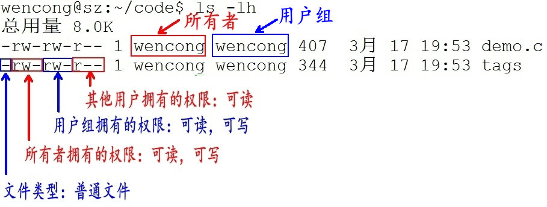

### 目录  
[01Linux操作系统介绍](#01linux操作系统介绍)  
[02Linux版本和应用](#02linux版本和应用)  
[03目录和文件以及文件分类](#03目录和文件以及文件分类)  
[04文件权限](#04文件权限)  
[05命令格式和快捷提示](#05命令格式和快捷提示)  
[06查看文件命令和重定向](#06查看文件命令和重定向)  
[15bzip2、zip压缩](#15bzip2、zip压缩)  

#### 01Linux操作系统介绍  
Linux里面没有文件扩展名，通过文件类型来判定  

返回：[目录](#目录)  

#### 02Linux版本和应用  
#### 03目录和文件以及文件分类  

目录：又称为文件夹，是包含所有的文件  
路径：是反应目录和文件的位置  

文件：在计算机中一切皆文件  
在windows中区分文件可以通过扩展名来区分 .exe .txt .ppt  
在Linux中文件没有扩展名 可以通过颜色区分 也可以通过命令来区分 file 文件名  

在Linux中文件分为：  
普通文件  
目录文件  
设备文件   字符设备文件 块设备文件  
管道文件  
链接文件  

返回：[目录](#目录)  
#### 04文件权限  
文件权限:  
读[r] read  
写[w] write  
执行[x] execute  

d rwx rwx rwx 分成三组  
d 目录 称为文件类型  
第一组：文件的所属用户  
第二组：文件的所属组（要考虑到同组成员的使用）  
第三组：其它用户  

  
1. 第1个字母代表文件的类型：“d” 代表文件夹、“-” 代表普通文件、“c” 代表硬件字符设备、“b” 代表硬件块设备、“s”表示管道文件、“l” 代表软链接文件。  
2. 后 9 个字母分别代表三组权限：文件所有者、用户者、其他用户拥有的权限。每一个用户都有它自身的读、写和执行权限。  

返回：[目录](#目录)  
#### 05命令格式和快捷提示  
Linux命令：  
格式 ：命令 选项  参数   

通配符：  
[\*] 匹配任意多个字符[0-256]  a*  一个以上字符 256一下  
[?] 匹配任意一个字符  a？ 两个字符  
[a-z] 区间法 匹配a到z的所有字符 只能确定一个字符  
[abcde] 穷举法 权值法 匹配abcde的所有字符 只能确定一个字符  

返回：[目录](#目录)  
#### 06查看文件命令和重定向  

返回：[目录](#目录)  
#### 15bzip2、zip压缩  

返回：[目录](#目录)  