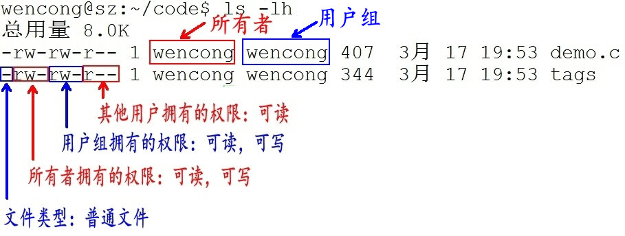

### 目录  
[01Linux操作系统介绍](#01linux操作系统介绍)  
[02Linux版本和应用](#02linux版本和应用)  
[03目录和文件以及文件分类](#03目录和文件以及文件分类)  
[04文件权限](#04文件权限)  
[05命令格式和快捷提示](#05命令格式和快捷提示)  
[06查看文件命令和重定向](#06查看文件命令和重定向)  
[07切换工作目录](#07切换工作目录)  
[08创建目录和删除目录](#08创建目录和删除目录)  
[09链接文件](#09链接文件)  
[10文本搜索](#10文本搜索)  
[14归档压缩](#14归档压缩)  
[15bzip2、zip压缩](#15bzip2、zip压缩)  

#### 01Linux操作系统介绍  
Linux里面没有文件扩展名，通过文件类型来判定  

返回：[目录](#目录)  

#### 02Linux版本和应用  
#### 03目录和文件以及文件分类  

目录：又称为文件夹，是包含所有的文件  
路径：是反应目录和文件的位置  

文件：在计算机中一切皆文件  
在windows中区分文件可以通过扩展名来区分 .exe .txt .ppt  
在Linux中文件没有扩展名 可以通过颜色区分 也可以通过命令来区分 file 文件名  

在Linux中文件分为：  
普通文件  
目录文件  
设备文件   字符设备文件 块设备文件  
管道文件  
链接文件  

返回：[目录](#目录)  
#### 04文件权限  
文件权限:  
读[r] read  
写[w] write  
执行[x] execute  

d rwx rwx rwx 分成三组  
d 目录 称为文件类型  
第一组：文件的所属用户  
第二组：文件的所属组（要考虑到同组成员的使用）  
第三组：其它用户  

  
1. 第1个字母代表文件的类型：“d” 代表文件夹、“-” 代表普通文件、“c” 代表硬件字符设备、“b” 代表硬件块设备、“s”表示管道文件、“l” 代表软链接文件。  
2. 后 9 个字母分别代表三组权限：文件所有者、用户者、其他用户拥有的权限。每一个用户都有它自身的读、写和执行权限。  

返回：[目录](#目录)  
#### 05命令格式和快捷提示  
Linux命令：  
格式 ：命令 选项  参数   

通配符：  
[\*] 匹配任意多个字符[0-256]  a*  一个以上字符 256一下  
[?] 匹配任意一个字符  a？ 两个字符  
[a-z] 区间法 匹配a到z的所有字符 只能确定一个字符  
[abcde] 穷举法 权值法 匹配abcde的所有字符 只能确定一个字符  

返回：[目录](#目录)  
#### 06查看文件命令和重定向  

返回：[目录](#目录)  
#### 07切换工作目录  
分屏显示，使用命令more，例如`ll | more`  
如果想切换下一页的话，使用空格就可以了  
切换工作目录：  
cd 【切换工作目录】cd 目录  
格式：  
cd 切换到用户主目录  
cd ~ 切换到当前用户的主目录  
cd .. 切换到上级目录   
cd .  切换到当前目录  
cd -  切换到上一次目录  

返回：[目录](#目录)  
#### 08创建目录和删除目录  
创建目录：  
mkdir 目录名 -p 递归创建  
rmdir 目录名  目录一定是空的   
rm 文件  -i询问 -r 递归传出  

返回：[目录](#目录)  
#### 09链接文件  
链接：  
格式：  
ln 源文件 链接文件 硬链接  
ln -s 源文件 链接文件 软连接  
硬链接文件占磁盘空间 但是删除源文件不会影响硬链接文件  
软链接文件不占磁盘空间 但是删除源文件会影响软链接文件  

硬链接和拷贝（复制）区别 无论你修改了哪一个链接之后的文件 两个文件都会改变 保持一致  但是拷贝不会  
1. 改变软链接文件就是相当于间接的改变了源文件  
2. 查看文件时默认链接数为1 如果有链接一次递增  
3. 如果创建的软链接文件和源文件在不同的目录下，需要使用绝对路径  

返回：[目录](#目录)  
#### 10文本搜索  
文本搜索：  
grep  '搜索内容' 文件名  
-n 显示行号  
-v 反选  
-i 忽略大小写  
#### 14归档压缩  
#### 15bzip2、zip压缩  
归档：  
tar -cvf 归档文件名.tar 文件1 文件2  目录1 目录2  
解归档：  
tar -xvf 归档文件名.tar  -C 路径  
 
压缩：  
gzip 归档文件名.tar  生成了一个文件 归档文件名.tar.gz 文件大小小于归档文件大小 归档文件名.tar不存在了  
解压缩：  
gzip -d 归档文件名.tar.gz 生成了一个文件 归档文件名.tar  

一步归档压缩：  
tar -czvf 文件名.tar.gz 文件1 文件2 目录1 目录2  

一步解归档压缩：  
tar -xzvf 文件名.tar.gz -C 路径  

bzip2压缩：  
tar -cjvf 文件名.tar.bz2 文件1 文件2 目录1 目录2  
bzip2解压缩：  
tar -xjvf 文件名.tar.bz2 -C 路径  

zip压缩：  
zip 文件名 文件1 文件2 目录1 目录2  生成一个文件为：文件名.zip  
unzip解压缩：  
unzip 文件名.zip -C 路径  

返回：[目录](#目录)  
